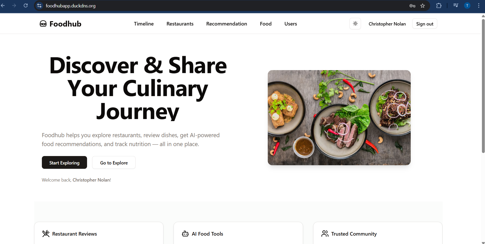
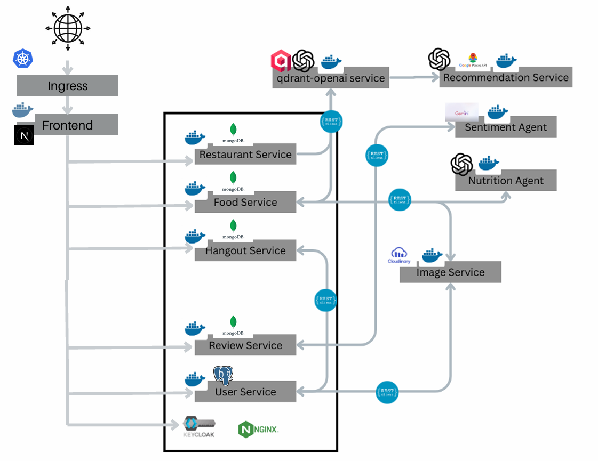
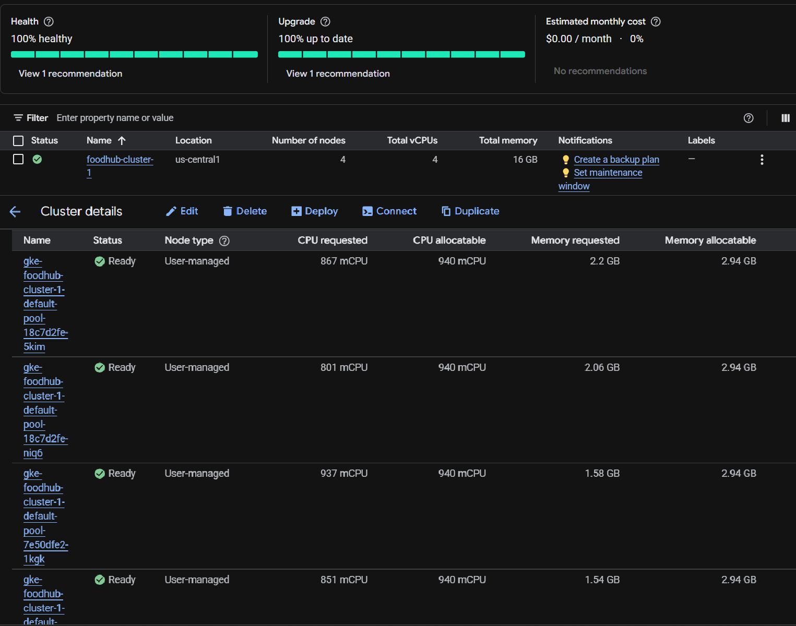
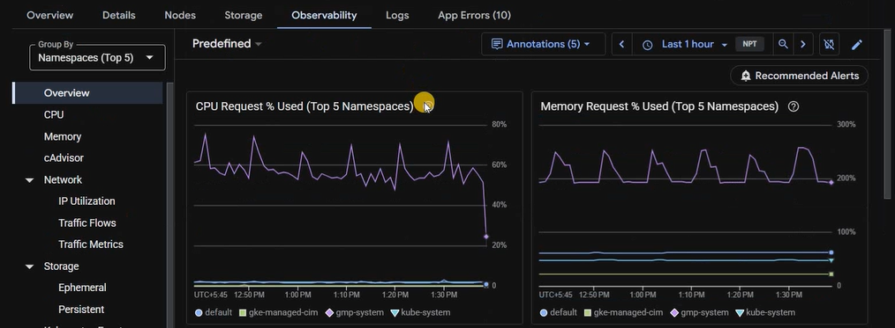
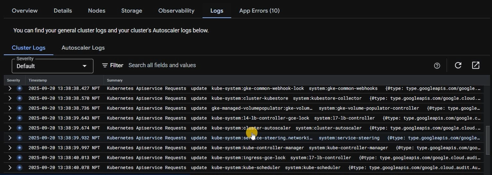
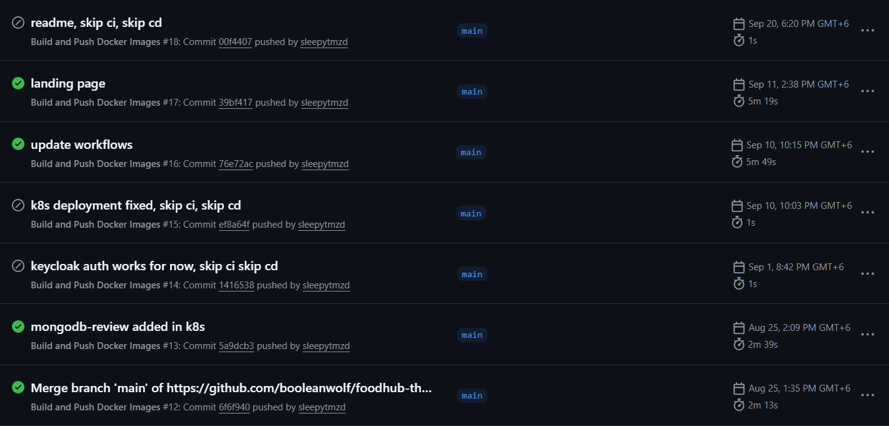

# Foodhub

Foodhub is a **full-stack web platform for food lovers** — a place to explore restaurants, share culinary experiences, write reviews, discover personalized recommendations with AI, check nutrition values of food items, and even plan hangouts with fellow critics.  

Built with a **microservices architecture**, Foodhub combines scalable backend services, intelligent AI agents, and a modern frontend experience — all containerized and deployed seamlessly with DevOps best practices.  



---

## Features
- **AI discovery with RAG**  
  Enter a natural-language query, optionally set a place or type, and get relevant food and restaurant recommendations — including nearby restaurants. Uses Retrieval-Augmented Generation to pull the most relevant items from the database and present them cleanly.

- **Reviews you can trust**  
  Create reviews on foods or restaurants, like and comment on others’ posts, and quickly find posts with fast filters/search. An AI sentiment analyzer classifies reviews (positive/neutral/negative), and a robust sorting system surfaces the most helpful content.

- **AI nutrition from images**  
  When creating a food, upload an image and let the AI generate a nutrition profile automatically. Results are displayed alongside the food for quick health insights.

- **Social and hangouts**  
  Follow other users to keep up with their discoveries. Invite friends to hangouts and plan your next food adventure together.

- **Secure, modern experience**  
  Keycloak-powered authentication, a responsive Next.js UI, and a clean design for an enjoyable user journey.

---

## Project Architecture

A modern, secure microservices architecture where each feature lives in its own service and database, all protected by Keycloak authentication.



- **Backend microservices (Spring Boot)**
  - **Food Service** — **MongoDB**. Manages foods; generates AI nutrition from images via the Nutrition Agent; uploads images via the Image Service.
  - **Restaurant Service** — **MongoDB**. Manages restaurants and their food relationships.
  - **Review Service** — **MongoDB**. Creates/reads reviews; calls the Sentiment Agent to classify review sentiment.
  - **Hangout Service** — **MongoDB**. Schedules and manages hangouts; collaborates with the User Service.
  - **User Service** — **PostgreSQL**. Profiles, avatars, social graph; integrates with Image Service for uploads.
  - **Image Service** — Stateless proxy to **Cloudinary**. Receives uploads from User/Food services and stores in Cloudinary.

  **Service interactions** (examples):
  - Food Service → Image Service → Cloudinary (image upload)
  - Food Service → Nutrition Agent (OpenAI GPT‑4) for nutrition-from-image
  - Review Service → Sentiment Agent (Gemini 2.0) for review sentiment
  - User Service → Image Service (avatars, covers)
  - User Service ↔ Hangout Service (invite/schedule)

- **AI agents** (FastAPI, Python)
  - **Nutrition Prediction Agent** — Uses OpenAI **GPT‑4o** on food images to produce a nutrition profile.
  - **Sentiment Analysis Agent** — Uses **Gemini 2.0** to classify reviews (positive/neutral/negative).
  - **Recommendation Agent** — Uses OpenAI **GPT‑4o** + **Qdrant** vector DB for **RAG** across Food/Restaurant data, and **Google Places** API for nearby restaurants.

  **Recommendation flow:**
  - Frontend → Recommendation Agent → Qdrant RAG over Food/Restaurant → Google Places (nearby) → results merged and returned.

- **Authentication & IAM** (Keycloak)
  - Dedicated **Keycloak** server backed by **PostgreSQL***.
  - All services validate JWTs issued by Keycloak (OIDC). Frontend attaches tokens to API calls.
  - Centralized roles/realms/clients for consistent access control.

- **Frontend** (Next.js)
  - Modern React UI that speaks directly to each microservice over **REST**.
  - Uses Keycloak for auth, shows AI recommendations, reviews, foods, restaurants, hangouts.

- **Data stores & external systems**
  - MongoDB: Food, Restaurant, Review, Hangout services.
  - PostgreSQL: User Service, Keycloak.
  - Qdrant: Vector similarity for recommendation RAG.
  - Cloudinary: Media storage for uploaded images.

- **Containerization & deployment**
  - **Docker Compose** (local): One-command spin-up of the entire stack for development.
  - **Kubernetes (Google Kubernetes Engine, GKE)**: Production-grade deployment using manifests in /k8s.
    - **Two ingresses**: one dedicated to authentication (Keycloak), one for the main app.
    - **4 worker nodes** (each ~60 GB disk, 4 vCPU, 4 GB RAM).
    - **Monitoring and logging** via GKE for availability, resilience, and scalability.
    - **Public domain** via DuckDNS: https://foodhubapp.duckdns.org






**High-level request flows:**
- Nutrition from image: Frontend → Food Service → Image Service → Cloudinary → Nutrition Agent (GPT‑4) → Food Service stores nutrition → Frontend displays.
- Review sentiment: Frontend → Review Service → Sentiment Agent (Gemini) → Review Service stores sentiment → Frontend surfaces labels/sorting.
- AI recommendations: Frontend → Recommendation Agent → Qdrant + Food/Restaurant + Google Places → Frontend renders recommended and nearby results.


---

## Usage Guide

### Run Locally with Docker Compose
1. Clone the repository  
   ```bash
   git clone https://github.com/sleepytmzd/foodhub-therap-javafest.git
   cd foodhub
   ```
2. Run with Docker compose
    ```bash
    docker compose up
    ```
3. Access the app at  http://localhost:7000

### Access Online Deployment on GKE
The project is already deployed and publicly available at:
 [https://foodhubapp.duckdns.org](https://foodhubapp.duckdns.org)

---
 ## Devops & CI/CD
 We follow DevOps best practices with GitHub Actions:
 - On every push to the `main` branch:

    1. Services are dockerized and images pushed to DockerHub
    2. Kubernetes cluster on GKE is updated with the latest images
- This ensures seamless, automated migration from development to production.



This project has been created by:

---
## Team Nezubytes
- Md. Tamim Sarkar
- Tamzeed Mahfuz

If you have any remarks, feel free to reach out!

## Demo Video
[Project youtube link](https://youtu.be/NxZBAfyFvio)


