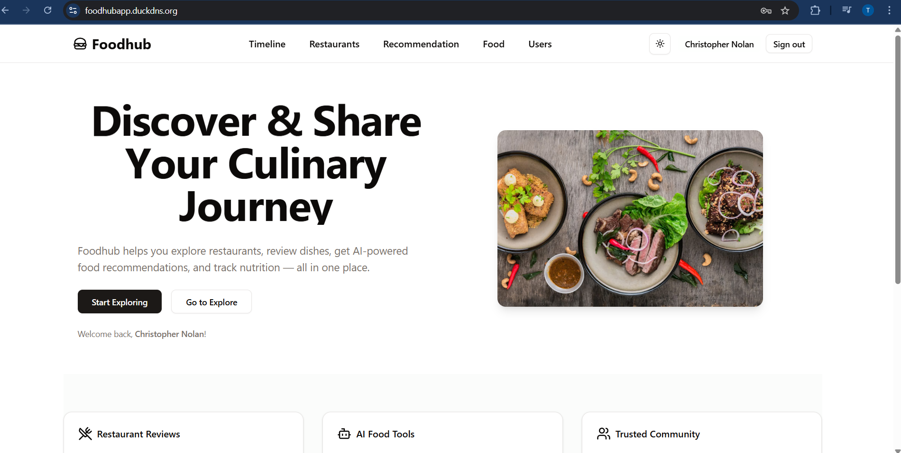

# Foodhub

Foodhub is a **full-stack web platform for food lovers** — a place to explore restaurants, share culinary experiences, write reviews, discover personalized recommendations with AI, check nutrition values of food items, and even plan hangouts with fellow critics.  

Built with a **microservices architecture**, Foodhub combines scalable backend services, intelligent AI agents, and a modern frontend experience — all containerized and deployed seamlessly with DevOps best practices.  



---

## Features
- **Restaurant & Food Reviews** – Share and read reviews from fellow food lovers.  
- **AI-Powered Tools** – Get personalized food/restaurant recommendations, sentiment analysis of reviews, and nutrition insights.  
- **Hangout Planning** – Organize food adventures with friends and critics.  
- **Secure Authentication** – Enterprise-grade identity management with **Keycloak**.  
- **Modern Frontend** – Built with **Next.js** for a smooth and responsive user experience.  

---

## Project Architecture

Foodhub follows a **microservices-based architecture**:  

### Backend Services (Spring Boot)
- **Food Service** – Manage food-related data  
- **Restaurant Service** – Restaurant listings and info  
- **User Service** – User profiles and management  
- **Review Service** – Store and fetch reviews  
- **Hangout Service** – Plan and manage hangouts  
- **Image Service** – Handle food/restaurant image uploads  

Each service (except image service) has its own database (**PostgreSQL** or **MongoDB**) ensuring independence and scalability.  

### AI Agents (FastAPI)
- **Sentiment Analysis Agent** – Analyzes user reviews  
- **Nutrition Analysis Agent** – Extracts nutrition information from food items/images  
- **Recommendation Agent** – Personalized suggestions using **MongoDB** + **Qdrant** (vector DB)  

### Frontend
- **Next.js** app as the user entrypoint  

### Authentication
- **Keycloak** for centralized authentication and authorization  

### Infrastructure
- **Containerized with Docker** – All services are available as Docker images on DockerHub  
- **Orchestration with Docker Compose** – Spin up the full stack locally with one command  
- **Deployed on Google Kubernetes Engine (GKE)** – All manifests in the `/k8s` folder  
- **Public Deployment:** [https://foodhubapp.duckdns.org](https://foodhubapp.duckdns.org)  

---

## Usage Guide

### Run Locally with Docker Compose
1. Clone the repository  
   ```bash
   git clone https://github.com/<your-repo>/foodhub.git
   cd foodhub
   ```
2. Run with Docker compose
    ```bash
    docker compose up
    ```
3. Access the app at  http://localhost:7000

### Access Online Deployment on GKE
The project is already deployed and publicly available at:
 [https://foodhubapp.duckdns.org](https://foodhubapp.duckdns.org)

---
 ## Devops & CI/CD
 We follow DevOps best practices with GitHub Actions:
 - On every push to the `main` branch:

    1. Services are dockerized and images pushed to DockerHub
    2. Kubernetes cluster on GKE is updated with the latest images
- This ensures seamless, automated migration from development to production.

This project has been created by:

---
## Team Nezubytes
- Md. Tamim Sarkar
- Tamzeed Mahfuz

If you have any remarks, feel free to reach out!

## Demo Video
[Project youtube link](https://youtu.be/NxZBAfyFvio)


